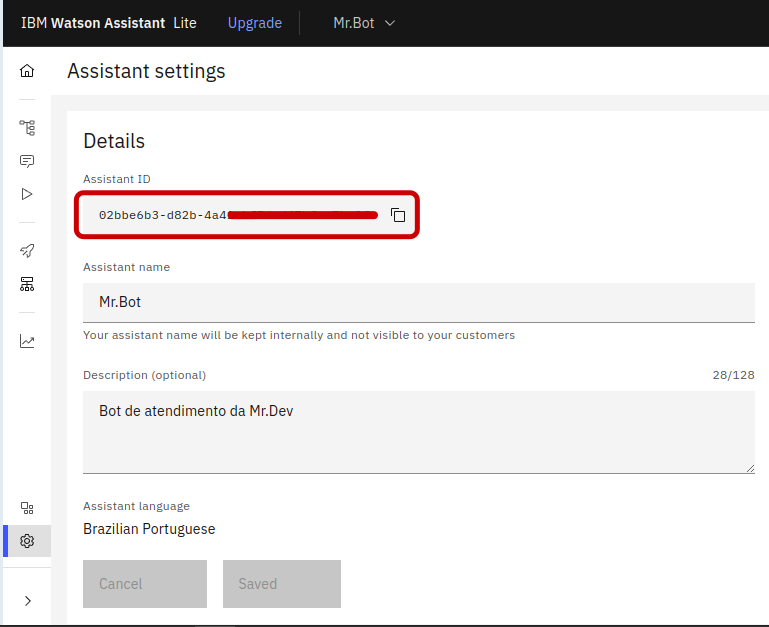
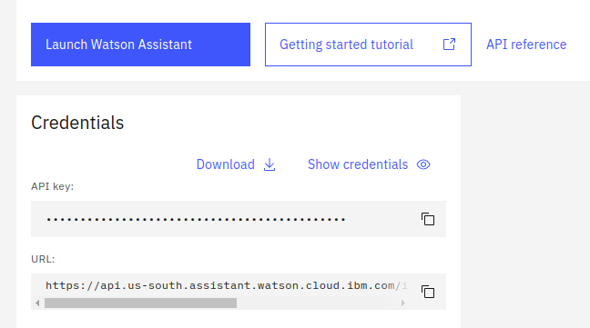
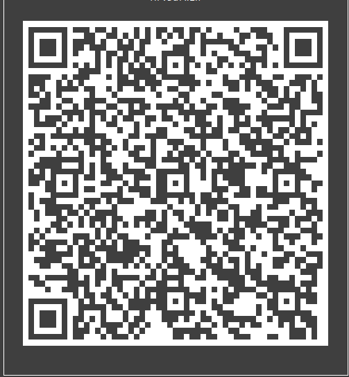
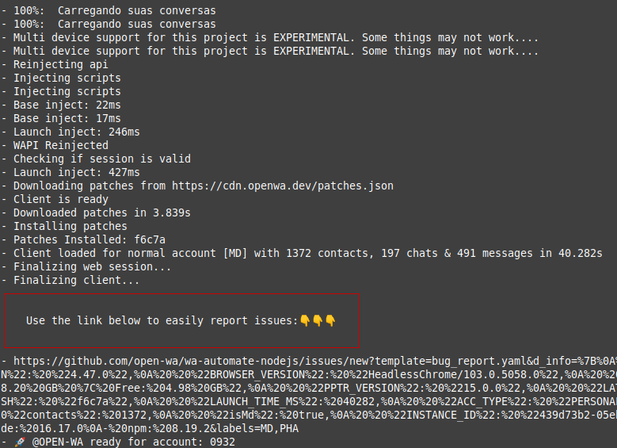

[TOC]

# Chatbot WhatsApp/Watson Assistant

Essa é uma integração do [Watson Assistant](https://www.ibm.com/br-pt/products/watson-assistant) (o chatbot da IBM) com o WhatsApp, integração esta, que é feita em [NodeJS](https://nodejs.org/pt-br/) e utiliza do pacote [NPM Wa Automate NodeJS](https://openwa.dev), cujo código fonte pode ser encontrado em [Wa Automate Github](https://github.com/open-wa/wa-automate-nodejs).

------

## Requisitos

- NodeJS >=12.

- Watson Assistant.

- Wa Automate NodeJS.

------

## Preparando o ambiente

### Instalando o NodeJS
É necessário instalar o [NodeJS](https://nodejs.org/pt-br/), que você pode encontrar neste [link](https://nodejs.org/en/download/), é recomendado o uso da versão estável mais recente disponível, porém a versão mínima aceita é NodeJS 12.
Use o comando "node --version" para verificar se o node foi instalado corretamente.

    node --version

Você deve receber algo como:

### Instalando dependências
Com o [NodeJS](https://nodejs.org/pt-br/) corretamente instalado na sua máquina, podemos instalar as dependências. Para realizar a conexão com o [Watson Assistant](https://www.ibm.com/br-pt/products/watson-assistant) usaremos o pacote [Watson NPM](https://www.npmjs.com/package/ibm-watson), e usaremos o [Wa Automate NodeJS](https://www.npmjs.com/package/@open-wa/wa-automate) para controlar as mensagens recebidas no [WhatsApp](https://www.whatsapp.com/?lang=pt_br). 
 Para instalar todas as dependências necessárias, execute o comando:

    npm install

Caso seja necessário instalar os pacotes separadamente use:

    npm i --save @open-wa/wa-automate@latest
    npm i --save ibm-watson@^7.1.1

### Configurando Watson Assistant
Agora precisamos configurar o [Watson Assistant](https://www.ibm.com/br-pt/products/watson-assistant), passando as credenciais do seu chatbot. Você pode achar suas credenciais nesse [link](https://cloud.ibm.com/services/conversation/crn%3Av1%3Abluemix%3Apublic%3Aconversation%3Aus-south%3Aa%2F7eb28963c03a40d688f89d2afcecf24a%3Ad6e9677b-5d78-4947-9488-b1e825f6851f%3A%3A?paneId=manage).

Assistant ID:

API KEY e Service URL:

Substitua os campos com suas credências conforme mostrado a baixo:

    /*Use suas credenciais aqui.*/
    const assistantID = '[ASSISTANT ID]';
    const assistant = new AssistantV2({
    version: '[Uma data no formato 2022-09-13]',
    authenticator: new IamAuthenticator({
    apikey: '[API KEY]',
    }),
    serviceUrl: '[URI DO WATSON ASSISTANT]',
    });

------

 ## Iniciando o Chatbot

Agora podemos iniciar o chatbot e fazer o login no [WhatsApp](https://www.whatsapp.com/?lang=pt_br), permitindo que o [Wa Automate](https://www.npmjs.com/package/@open-wa/wa-automate), tenha acesso as mensagens recebidas.
Execute o seguinte comando (na pasta do seu projeto) para iniciar o servidor:

    node index.js
Nesse momento o servidor irá iniciar sua configuração, o que deve demorar apenas alguns segundos, e será exibido o QR Code para login no [WhatsApp](https://www.whatsapp.com/?lang=pt_br).

 Após escanear o QR, havendo sucesso na conexão, o [Wa Automate](https://www.npmjs.com/package/@open-wa/wa-automate) irá carregar mais algumas configurações, e o bot já estará online.

E pronto! :smile:
